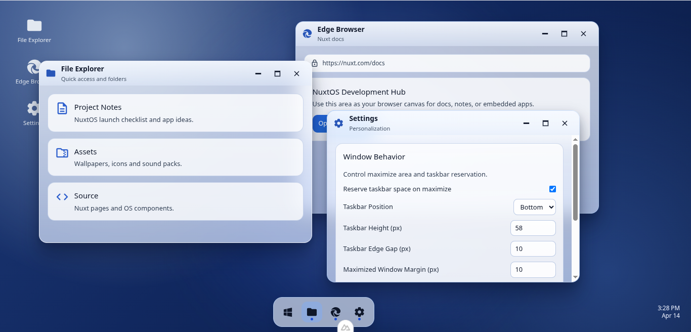

# NuxtOS 🌟



A beautiful, highly functional, desktop-style operating system built entirely in the browser using **Nuxt 4** and **Vue 3**. 

Instead of traditional website routing, NuxtOS completely immerses the user in a windowed desktop environment right from their browser. 

## ✨ Key Features
- **Custom Window Manager**: Handles window lifecycle, Z-indexing, dragging, and resizing completely natively with Vue composables (no heavy third-party UI draggable libraries).
- **Dynamic Application Registry**: Easily inject and mount nested application modules into the OS shell via a simple typescript registry.
- **Frosted Glass UI**: Ultra-premium UI components heavily utilizing `backdrop-blur`, including a Spotlight-style central **Command Menu** and an intelligent configurable **Taskbar**.
- **Deep Linking**: Launch directly into specific applications using path-based routing (e.g. `/admin/calculator?value=123`).

## 🚀 Getting Started

Make sure to install dependencies:
```bash
pnpm install
```

Start the development server:
```bash
pnpm dev
```
*Note: Due to the `--host` flag in package.json, this will be accessible across your local network.*

## 📚 Documentation
For an in-depth look into the architectural patterns of the OS Shell, see the local `/docs` folder:
- **`docs/AI-HANDOFF.md`** - Core architecture map, runtime state ownership, and the guardrails of the system.
- **`docs/FEATURE-PLAYBOOKS.md`** - Step-by-step instructions for adding apps, settings, or hooking into the maximize constraints.
